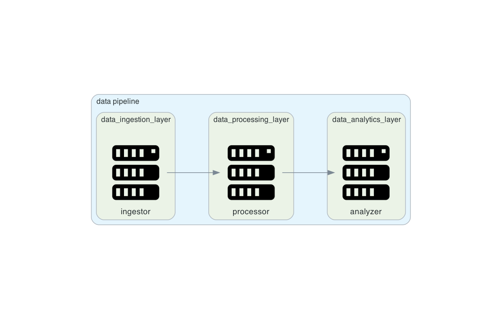

# Diagram as code

Diagram as code by [Diagrams](https://github.com/mingrammer/diagrams)

# Installation Guide
- [Graphviz](https://www.graphviz.org/)

```sh
brew install graphviz
poetry install
```

# How to generate image

write python code in path: `/diagram`
then, execute command below :
```sh
poetry run python diagrams/sample.py
```


